Giant pile of mail and need to sort it into boxes labeled "Customer Service," "Returns," and "Shipping." **Text Classification** is simply teaching a computer to do that sorting automatically.

The goal is to give the computer some text (Input) and have it put it in the correct box (Label/Class).

## How it Works (The Basic Flow)

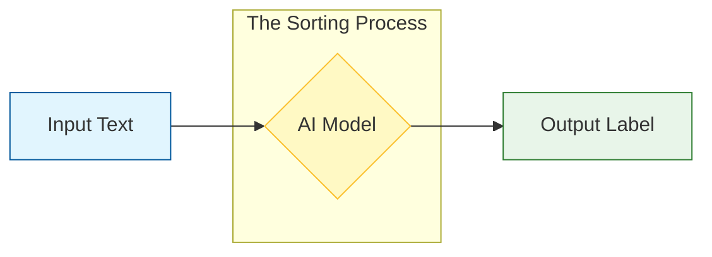

**Real-world examples:**
*   **Sentiment Analysis:** Is this tweet happy or sad?
*   **Intent Detection:** Does the user want to book a flight or cancel one?
*   **Spam Filtering:** Is this email junk or important?

---
## Representation Model
     Read text and directly outputs a number or category. It doesn't write sentences; it just picks category.

*   **Analogy:** A mail sorter who just looks at a letter and throws it into the "Bills" bin.
*   **Output:** A specific class (e.g., Class 1).

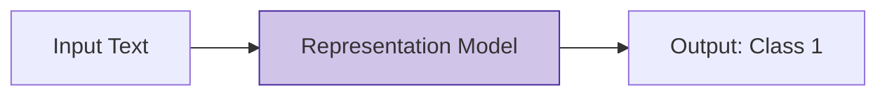

### Generative Model
ask it prompt and it generate text response that tells you the category.

*   **Analogy:** A consultant who reads the letter and says, "Based on my analysis, this letter belongs to the Returns department."
*   **Output:** A sentence describing the class.

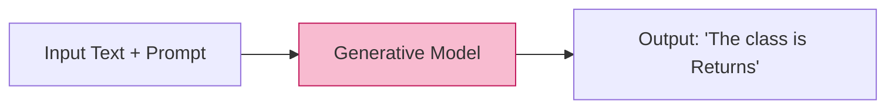

---

## The Big Picture Comparison

Here is a side-by-side look at how these two approaches handle the same task.

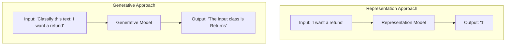

## Key Takeaway
Sometimes, simple math and basic classifier (Logistic Regression) can be just as good and much faster than a giant AI.

---

# Dataset: Rotten Tomatoes Movie Reviews

 from website **Rotten Tomatoes**.

## What's in the Data?

**10,662 movie reviews**. Each review comes with two pieces of information:
1.  **The Text:** actual words written about movie.
2.  **The Label:** number telling us if review is good or bad.

*   **1** = Positive 
*   **0** = Negative

only two options, this is **Binary Sentiment Classification**.

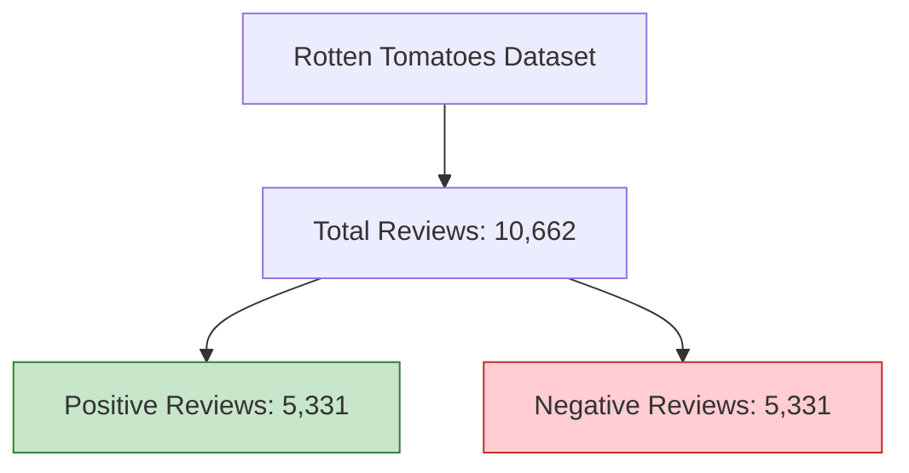

---


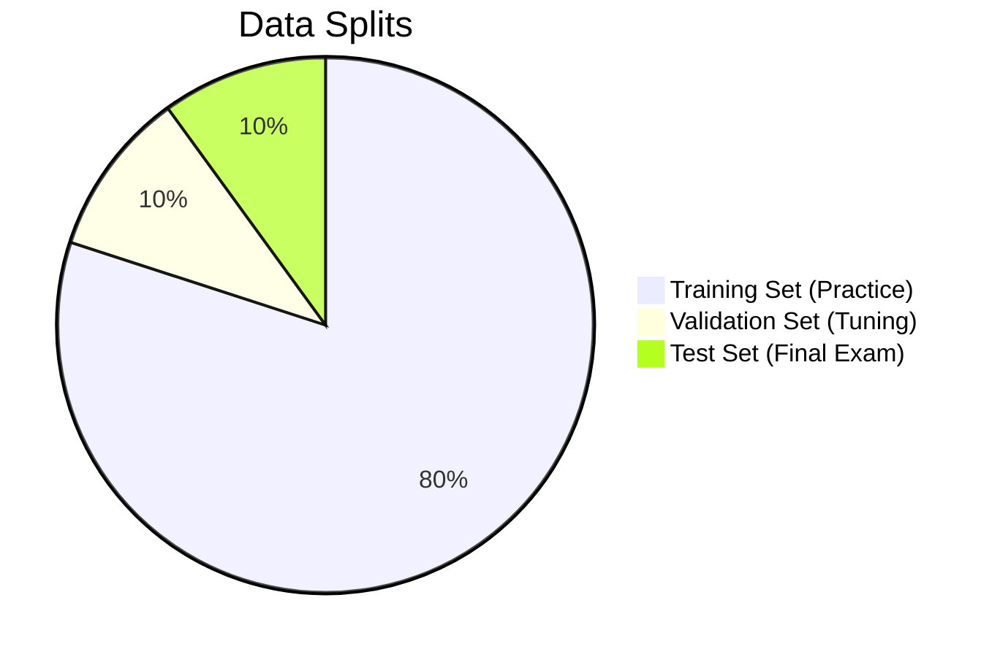

1.  **Train (8,530 reviews)** 
2.  **Validation (1,066 reviews)**
3.  **Test (1,066 reviews)** 

---
### Example 1: Positive Review (Label = 1)
> *"the rock is destined to be the 21st century's new 'conan' and that he's going to make a splash even greater than arnold schwarzenegger..."*

**Why is this positive?** The words "destined," "new," and "greater" suggest excitement and success.

### Example 2: Negative Review (Label = 0)
> *"things really get weird , though not particularly scary : the movie is all portent and no content ."*

**Why is this negative?** The phrases "not particularly scary" and "no content" suggest the movie failed to deliver what it promised.

---

## Workflow

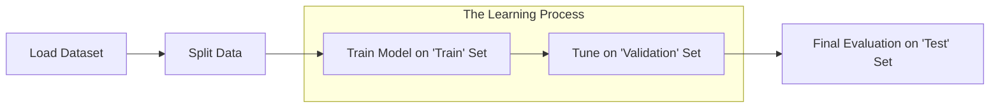

**Key Takeaway:** We are using balanced dataset (equal numbers of good and bad reviews) to teach computer how to read movie review and predict if review is +ve or -ve.

# Text Classification with Representation Model

Representation models are used for classification in two distinct ways: as **Task-Specific Models** or as **Embedding Models**. Both are created by taking a foundation model (like BERT) and fine-tuning it.

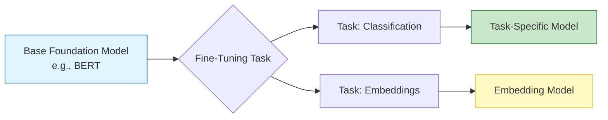

---

## Two Flavors of Representation Model

### 1. Task-Specific Model
output Positive or Negative

### 2. Embedding Model

---

## Frozen Model

don't  train or fine-tune keep them **frozen** (nontrainable) and only use their output.

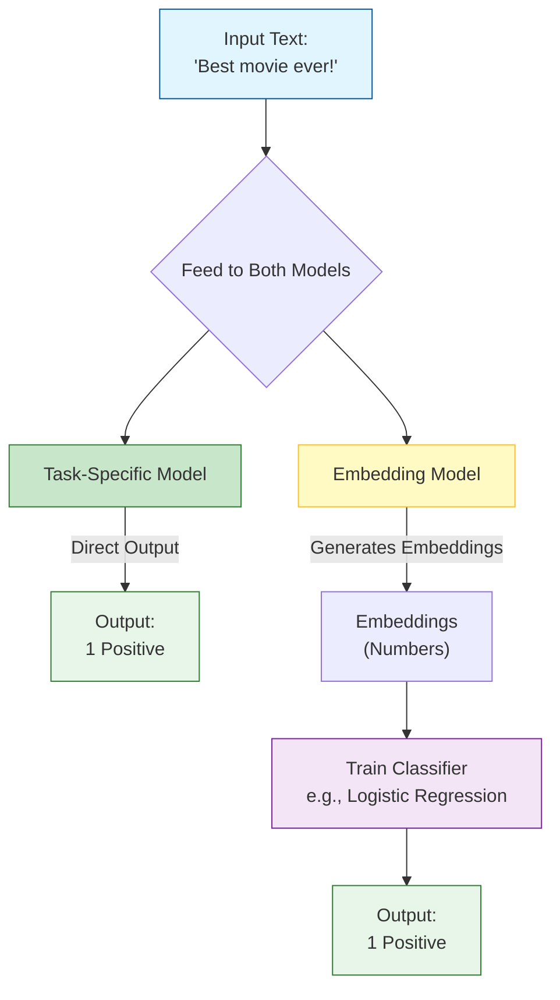

### Direct vs. Indirect Classification

*   **Direct (Task-Specific):** The model directly outputs the class (e.g., "1 Positive").
*   **Indirect (Embedding):** The model outputs embeddings (numbers). You then use those numbers to train a separate, simple classifier (like logistic regression) to predict the class.

---

## Key Characteristics

| Model Type        | Output                         | Flexibility                                     | Training Required in This Chapter |
| :---------------- | :----------------------------- | :---------------------------------------------- | :-------------------------------- |
| **Task-Specific** | Classification Label (e.g., 1) | Low (Only does classification)                  | None (Frozen)                     |
| **Embedding**     | Vector of Numbers              | High (Can be used for search, clustering, etc.) | Only a simple classifier on top   |

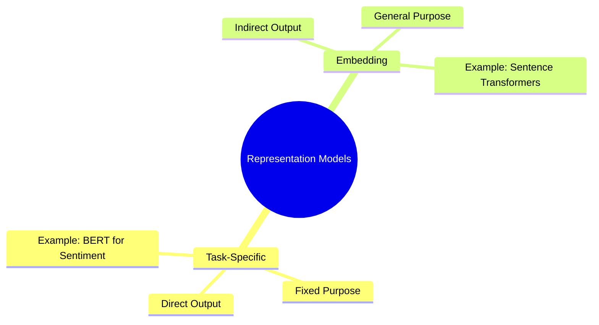

# Model Selection

Choosing right model from 60,000 text classification models and 8,000 embedding models on Hugging Face requires considering architecture, language compatibility, size and performance.

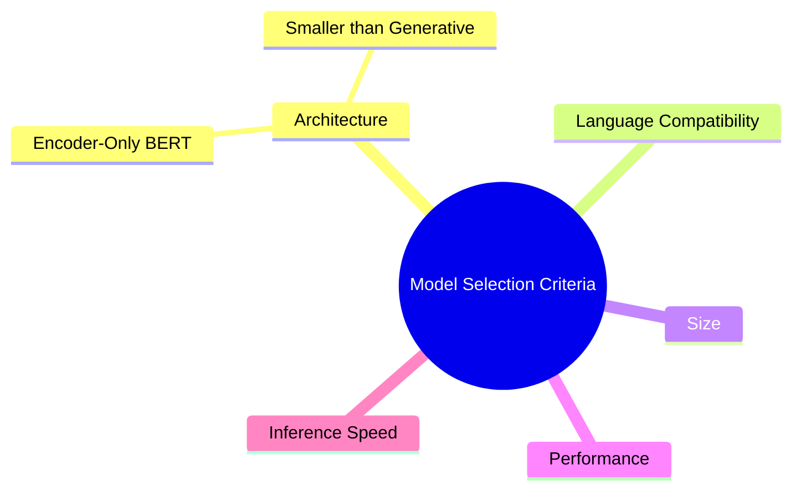

---

## Architecture: Encoder-Only vs. Generative

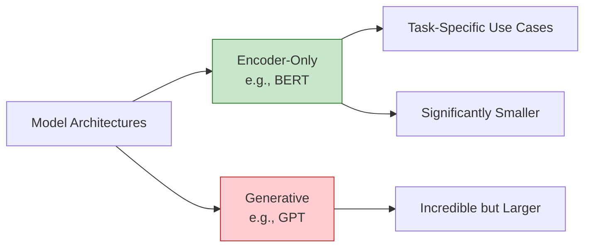

BERT (encoder-only) is a popular choice for task-specific and embedding models. It excels at task-specific use cases and tends to be significantly smaller than generative models like GPT.

---

## BERT Variations Timeline

Many variations of BERT have been developed, each trained in different contexts.

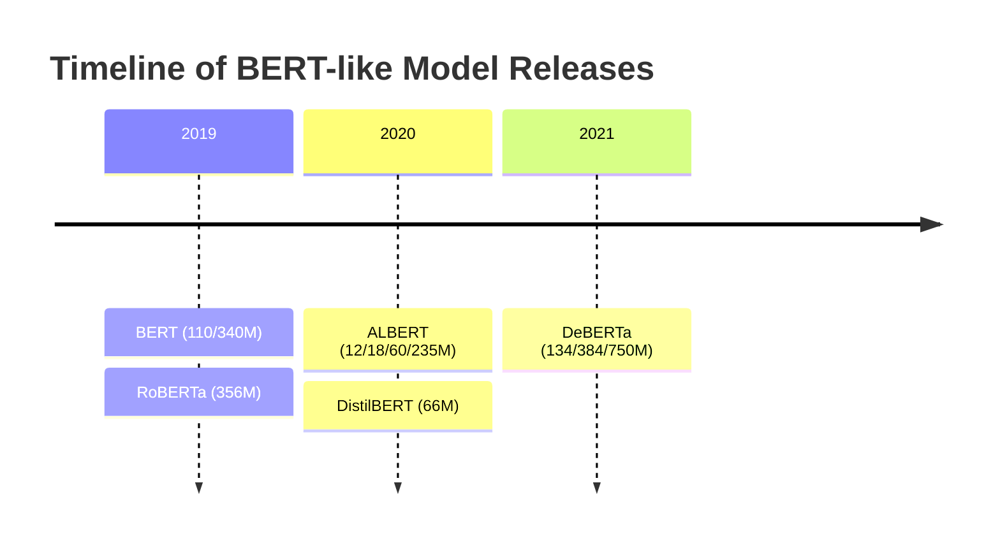

These are foundation models mostly intended to be fine-tuned on downstream tasks.

---

## Solid Baseline Models

Trying thousands of pretrained models is not feasible. These models are great starting points for base performance:

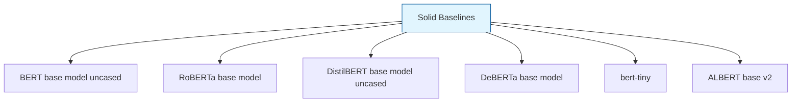

---

## Selected Models for This Chapter

### Task-Specific Model

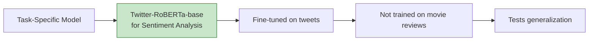

We choose **Twitter-RoBERTa-base for Sentiment Analysis**—a RoBERTa model fine-tuned on tweets. It was not trained on movie reviews, making it interesting to see how it generalizes.

### Embedding Model

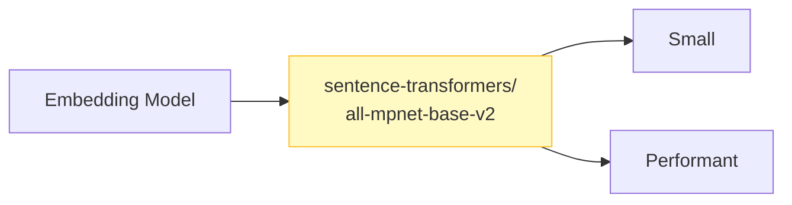

For embeddings, the **MTEB leaderboard** is a great starting point. We use **all-mpnet-base-v2** because it is small but performant.

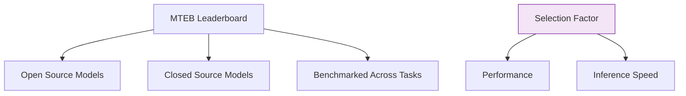

Do not underestimate inference speed in real-life solutions.

# Using Task-Specific Model

## Loading the Model and Tokenizer

We load the task-specific model `cardiffnlp/twitter-roberta-base-sentiment-latest` using the `pipeline` function.

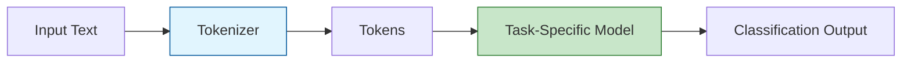

tokenizer convert input text into individual tokens. These tokens are core of most language models. A major benefit is that tokens can be combined to generate representation even if word was not in training data.

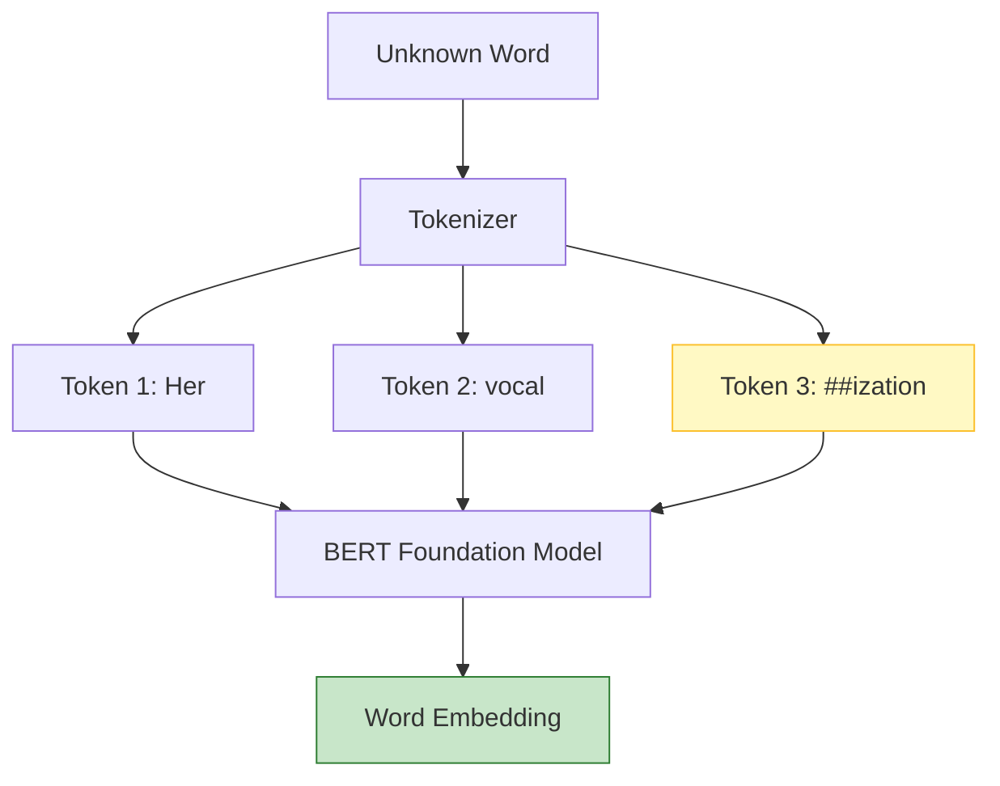

---

## Running Inference

We run the pipeline on the test split of our data.

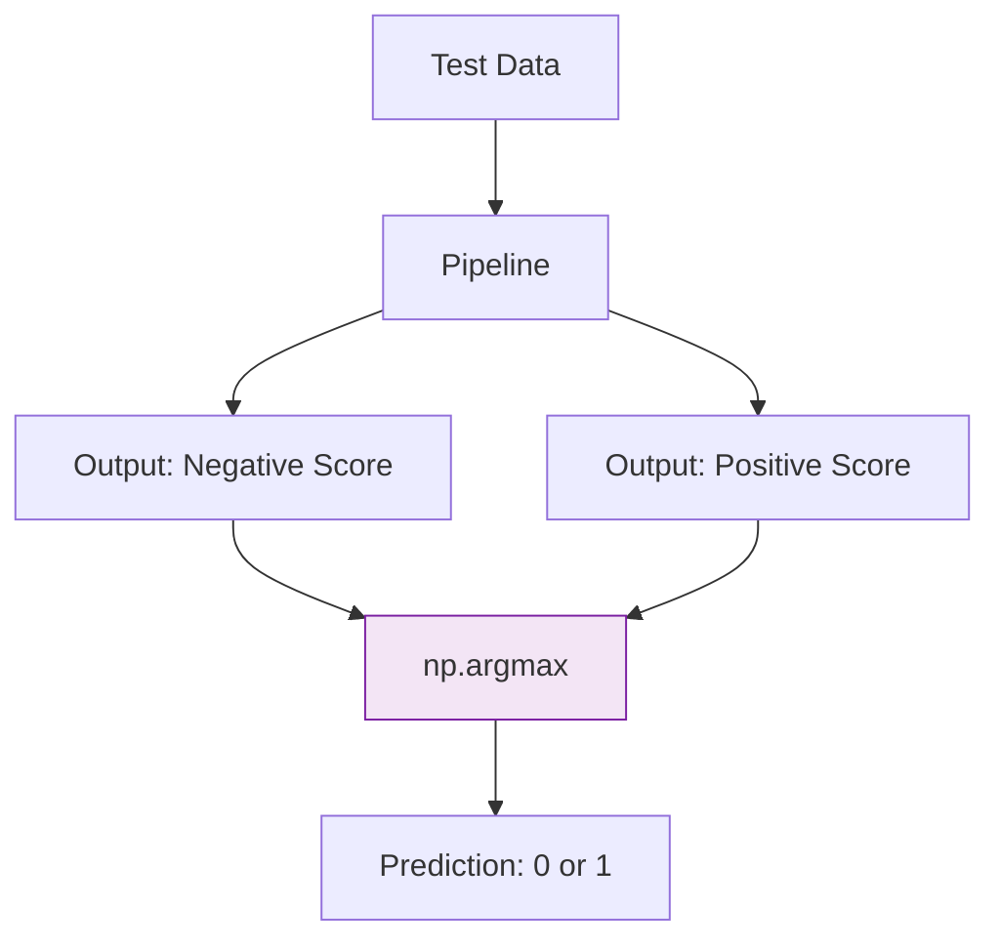

For each review, we extract the negative and positive scores, then use `np.argmax` to pick the higher one as our prediction.

---

## Evaluation Metrics

We evaluate predictions using a classification report.

```mermaid
graph TD
    A[Confusion Matrix] --> B[True Positive]
    A --> C[False Positive]
    A --> D[False Negative]
    A --> E[True Negative]
    
    B --> F[Precision]
    C --> F
    B --> G[Recall]
    D --> G
    B --> H[Accuracy]
    C --> H
    D --> H
    E --> H
    F --> I[F1 Score]
    G --> I
    
    style F fill:#e1f5fe,stroke:#01579b
    style G fill:#fff9c4,stroke:#fbc02d
    style H fill:#c8e6c9,stroke:#2e7d32
    style I fill:#f3e5f5,stroke:#7b1fa2
```

| Metric | Definition |
| :--- | :--- |
| **Precision** | How many of the items found are relevant |
| **Recall** | How many relevant classes were found |
| **Accuracy** | How many correct predictions out of all predictions |
| **F1 Score** | Balances precision and recall |

```mermaid
graph LR
    A[TP] --> B[Precision = TP / TP + FP]
    C[TP] --> D[Recall = TP / TP + FN]
    E[TP + TN] --> F[Accuracy = TP + TN / TP + TN + FP + FN]
    B --> G[F1 = 2 * Precision * Recall / Precision + Recall]
    D --> G
    
    style B fill:#e1f5fe,stroke:#01579b
    style D fill:#fff9c4,stroke:#fbc02d
    style F fill:#c8e6c9,stroke:#2e7d32
    style G fill:#f3e5f5,stroke:#7b1fa2
```

---

## Classification Report Results

```mermaid
graph TD
    A[Classification Report] --> B[Negative Review]
    A --> C[Positive Review]
    A --> D[Accuracy: 0.80]
    A --> E[Macro Avg: 0.80]
    A --> F[Weighted Avg: 0.80]
    
    B --> B1[Precision: 0.76]
    B --> B2[Recall: 0.88]
    B --> B3[F1: 0.81]
    
    C --> C1[Precision: 0.86]
    C --> C2[Recall: 0.72]
    C --> C3[F1: 0.78]
    
    style F fill:#c8e6c9,stroke:#2e7d32
```

We use the **weighted average F1 score** to treat each class equally. Our pretrained BERT model gives an **F1 score of 0.80**, which is great for a model not trained specifically on movie reviews.

---

## Ways to Improve Performance

```mermaid
mindmap
  root((Improve Performance))
    Select Domain-Specific Model
      DistilBERT finetuned SST-2
    Shift to Embedding Models
      Another flavor of representation models
```

# Classification Tasks That Leverage Embeddings

## Supervised Classification with Frozen Embeddings

When a pretrained task-specific model is unavailable, we do not need to fine-tune a representation model ourselves. Instead, we use a general-purpose embedding model to generate features, then train a lightweight classifier on top.

```mermaid
graph LR
    A[Text Input] --> B[Embedding Model]
    B --> C[Embeddings]
    C --> D[Classifier]
    D --> E[Label]
    
    style B fill:#c8e6c9,stroke:#2e7d32
    style D fill:#fff9c4,stroke:#fbc02d
```

This is a **two-step approach**:
1. **Feature Extraction:** The embedding model converts text to numerical vectors. It is kept **frozen** (not updated during training).
2. **Classification:** A trainable classifier (e.g., logistic regression) learns to map embeddings to labels.

```mermaid
graph TD
    subgraph Step1["Step 1: Feature Extraction (Frozen)"]
        A[Input Text] --> B[Embedding Model]
        B --> C[768-dim Vector]
    end
    
    subgraph Step2["Step 2: Classification (Trainable)"]
        C --> D[Logistic Regression]
        D --> E[Output: Positive/Negative]
    end
    
    style B fill:#c8e6c9,stroke:#2e7d32
    style D fill:#fff9c4,stroke:#fbc02d
```

**Benefit:** We avoid costly fine-tuning of the embedding model. The classifier trains quickly on CPU.

---

## Step 1: Generate Embeddings

Using `sentence-transformers`:

```mermaid
graph LR
    A[sentence-transformers/<br/>all-mpnet-base-v2] --> B[model.encode]
    B --> C[train_embeddings<br/>shape: 8530 x 768]
    B --> D[test_embeddings<br/>shape: 1066 x 768]
    
    style C fill:#e1f5fe,stroke:#01579b
    style D fill:#e1f5fe,stroke:#01579b
```

Each input document becomes a vector of **768 numerical values**.

```mermaid
graph TD
    A[Input Document] --> B[Embedding Vector]
    B --> C[Value 1]
    B --> D[Value 2]
    B --> E[...]
    B --> F[Value 768]
    
    style B fill:#c8e6c9,stroke:#2e7d32
```

---

## Step 2: Train Classifier

Using `LogisticRegression` from scikit-learn:

```mermaid
graph LR
    A[train_embeddings] --> B[LogisticRegression.fit]
    C[train_labels] --> B
    B --> D[Trained Classifier]
    
    D --> E[Predict on test_embeddings]
    E --> F[y_pred]
    
    style B fill:#fff9c4,stroke:#fbc02d
    style D fill:#f3e5f5,stroke:#7b1fa2
```

The classifier is not limited to logistic regression—any classification algorithm can be used.

---

## Evaluation Results

```mermaid
graph TD
    A[Classification Report] --> B[Negative Review]
    A --> C[Positive Review]
    A --> D[Accuracy: 0.85]
    A --> E[Macro Avg: 0.85]
    A --> F[Weighted Avg: 0.85]
    
    B --> B1[Precision: 0.85]
    B --> B2[Recall: 0.86]
    B --> B3[F1: 0.85]
    
    C --> C1[Precision: 0.86]
    C --> C2[Recall: 0.85]
    C --> C3[F1: 0.85]
    
    style F fill:#c8e6c9,stroke:#2e7d32
```

Training a classifier on top of frozen embeddings achieved an **F1 score of 0.85**, demonstrating the effectiveness of this approach.

---

## Removing GPU Dependency

```mermaid
mindmap
  root((Embedding Generation Options))
    Local GPU
      sentence-transformers
      Benefits from GPU speedup
    External API
      Cohere
      OpenAI
      Runs entirely on CPU
```

Using an external API for embeddings removes the GPU dependency, allowing the entire pipeline to run on CPU.

# What If We Do Not Have Labeled Data?

## Zero-Shot Classification with Embeddings

When labeled data is unavailable, we can still perform classification using **zero-shot classification**. We know the names of the labels, but we have no labeled examples to train on.

```mermaid
graph TD
    A[Input Text] --> B[Zero-Shot Model]
    C[Candidate Labels] --> B
    B --> D[Output: Best Matching Label]
    
    style B fill:#c8e6c9,stroke:#2e7d32
```

The zero-shot model decides how the input is related to the candidate labels without ever being trained on them.

```mermaid
graph LR
    A[Input: 'Explore the world's flavors...'] --> B[Zero-Shot Model]
    C[Candidate Labels:<br/>travel, cooking, sports] --> B
    B --> D[Output Scores:<br/>Cooking: 0.60, Travel: 0.35, Sports: 0.05]
    
    style D fill:#e8f5e9,stroke:#2e7d32
```

---

## The Embedding Trick: Describe Your Labels

To perform zero-shot classification with embeddings, we describe each label based on what it represents.

```mermaid
graph LR
    A[Label: 0 negative] --> B[Description: 'A negative review']
    C[Label: 1 positive] --> D[Description: 'A positive review']
    
    B --> E[Embedding Model]
    D --> E
    E --> F[Label Embeddings]
    
    style E fill:#c8e6c9,stroke:#2e7d32
    style F fill:#fff9c4,stroke:#fbc02d
```

By describing and embedding the labels and documents, we can work with data without any labeled examples.

```mermaid
graph TD
    A[Document: 'Best movie ever!'] --> B[Embedding Model]
    C[Label Description: 'A negative review'] --> B
    D[Label Description: 'A positive review'] --> B
    
    B --> E[Document Embedding]
    B --> F[Negative Label Embedding]
    B --> G[Positive Label Embedding]
    
    style E fill:#e1f5fe,stroke:#01579b
    style F fill:#ffcdd2,stroke:#c62828
    style G fill:#c8e6c9,stroke:#2e7d32
```

---

## Measuring Similarity: Cosine Similarity

We use **cosine similarity** to check how similar a document is to each label description. The label with the highest similarity is chosen.

```mermaid
graph TD
    A[Document Embedding] --> B[Cosine Similarity]
    C[Positive Label Embedding] --> B
    B --> D[Score: 0.92]
    
    A --> E[Cosine Similarity]
    F[Negative Label Embedding] --> E
    E --> G[Score: 0.08]
    
    D --> H[Chosen Label: Positive]
    G --> H
    
    style D fill:#c8e6c9,stroke:#2e7d32
    style G fill:#ffcdd2,stroke:#c62828
    style H fill:#f3e5f5,stroke:#7b1fa2
```

Cosine similarity is the cosine of the angle between vectors, calculated as the dot product of the embeddings divided by the product of their lengths.

```mermaid
graph LR
    A[Document Vector] --> C[Angle θ1: Document vs Positive]
    B[Positive Label Vector] --> C
    
    A --> D[Angle θ2: Document vs Negative]
    E[Negative Label Vector] --> D
    
    C --> F[Higher Similarity = Smaller Angle]
    D --> G[Lower Similarity = Larger Angle]
    
    style C fill:#c8e6c9,stroke:#2e7d32
    style D fill:#ffcdd2,stroke:#c62828
```

---

## Implementation

```mermaid
graph TD
    A[Create Label Embeddings] --> B[model.encode<br/>'A negative review', 'A positive review']
    B --> C[Calculate Cosine Similarity]
    C --> D[sim_matrix = cosine_similarity<br/>test_embeddings, label_embeddings]
    D --> E[y_pred = np.argmax<br/>sim_matrix, axis=1]
    
    style D fill:#fff9c4,stroke:#fbc02d
    style E fill:#c8e6c9,stroke:#2e7d32
```

---

## Evaluation Results

```mermaid
graph TD
    A[Classification Report] --> B[Negative Review]
    A --> C[Positive Review]
    A --> D[Accuracy: 0.78]
    A --> E[Macro Avg: 0.78]
    A --> F[Weighted Avg: 0.78]
    
    B --> B1[Precision: 0.78]
    B --> B2[Recall: 0.77]
    B --> B3[F1: 0.78]
    
    C --> C1[Precision: 0.77]
    C --> C2[Recall: 0.79]
    C --> C3[F1: 0.78]
    
    style F fill:#c8e6c9,stroke:#2e7d32
```

An **F1 score of 0.78** is impressive considering no labeled data was used at all.

---

## Improving Label Descriptions

```mermaid
mindmap
  root((Improve Zero-Shot Performance))
    Current Labels
      "A negative review"
      "A positive review"
    Improved Labels
      "A very negative movie review"
      "A very positive movie review"
    Benefits
      Captures domain (movie)
      Focuses on extremes
```

Making label descriptions more concrete and specific to the domain can improve results. For example, using "A very negative movie review" instead of "A negative review" helps the embedding capture the movie context and focus on the extremes of sentiment.

# Text Classification with Generative Models

## How Generative Models Differ

Generative models (like GPT and T5) work differently from task-specific models. They are **sequence-to-sequence** models: they take text as input and generate text as output.

```mermaid
graph TD
    subgraph TaskSpecific["Task-Specific Model"]
        A1[Input: Sequence of Tokens] --> B1[Model]
        B1 --> C1[Output: Numerical Value]
    end
    
    subgraph Generative["Generative Model"]
        A2[Input: Sequence of Tokens] --> B2[Model]
        B2 --> C2[Output: Sequence of Tokens]
    end
    
    style B1 fill:#c8e6c9,stroke:#2e7d32
    style B2 fill:#f8bbd0,stroke:#c2185b
```

These models are trained on a wide variety of tasks and do not perform your specific use case out of the box. They need to be guided through **prompt engineering**.

```mermaid
graph LR
    A[Input Prompt] --> B[Generative Model]
    B --> C[Output Completion]
    C --> D{Good Enough?}
    D -->|No| E[Improve Prompt]
    E --> A
    D -->|Yes| F[Final Output]
    
    style E fill:#fff9c4,stroke:#fbc02d
    style F fill:#c8e6c9,stroke:#2e7d32
```

---

## The T5 Architecture

T5 (Text-to-Text Transfer Transformer) uses the original Transformer encoder-decoder architecture with 12 encoders and 12 decoders stacked together.

```mermaid
graph TD
    A[Input Sequence] --> B[Encoder x12]
    B --> C[Decoder x12]
    C --> D[Output Sequence]
    
    style B fill:#e1f5fe,stroke:#01579b
    style C fill:#f8bbd0,stroke:#c2185b
```

### Pretraining with Masked Language Modeling

Instead of masking individual tokens, T5 masks **sets of tokens** (token spans) during pretraining.

```mermaid
graph LR
    A[Input: LLMs can be used for MASK] --> B[T5 Model]
    B --> C[Output: LLMs can be used for text generation]
    
    style B fill:#f8bbd0,stroke:#c2185b
    style C fill:#c8e6c9,stroke:#2e7d32
```

### Fine-Tuning on Multiple Tasks

Each task is converted to a sequence-to-sequence format and trained simultaneously.

```mermaid
graph TD
    A[Translate: My name is Maarten] --> B[T5 Model]
    B --> C[Output: Mijn naam is Maarten]
    
    D[Grammar: The building is tall and wide] --> B
    B --> E[Output: Acceptable]
    
    F[Summarize: Reading books has many advantages...] --> B
    B --> G[Output: Reading improves mental health...]
    
    style B fill:#f8bbd0,stroke:#c2185b
```

This method was extended to **Flan-T5**, which was fine-tuned on over a thousand tasks that follow instructions.

---

## Using Flan-T5 for Classification

### Loading the Model

```mermaid
graph LR
    A[Pipeline: text2text-generation] --> B[google/flan-t5-small]
    B --> C[Model Ready]
    
    style B fill:#f8bbd0,stroke:#c2185b
```

### Preparing the Prompt

We prefix each document with an instruction.

```mermaid
graph LR
    A[Original Text: 'Best movie ever!'] --> B[Prompt: 'Is the following sentence positive or negative? ']
    B --> C[Combined Input: 'Is the following sentence positive or negative? Best movie ever!']
    
    style C fill:#e1f5fe,stroke:#01579b
```

### Running Inference

```mermaid
graph TD
    A[Combined Input] --> B[Flan-T5 Model]
    B --> C[Generated Text: 'positive' or 'negative']
    C --> D[Map to Numerical: positive=1, negative=0]
    D --> E[Prediction]
    
    style B fill:#f8bbd0,stroke:#c2185b
    style E fill:#c8e6c9,stroke:#2e7d32
```

### Converting Text to Numbers

```mermaid
graph LR
    A[Generated Text] --> B{Is it 'negative'?}
    B -->|Yes| C[Map to 0]
    B -->|No| D[Map to 1]
    
    style C fill:#ffcdd2,stroke:#c62828
    style D fill:#c8e6c9,stroke:#2e7d32
```

---

## Evaluation Results

```mermaid
graph TD
    A[Classification Report] --> B[Negative Review]
    A --> C[Positive Review]
    A --> D[Accuracy: 0.84]
    A --> E[Macro Avg: 0.84]
    A --> F[Weighted Avg: 0.84]
    
    B --> B1[Precision: 0.83]
    B --> B2[Recall: 0.85]
    B --> B3[F1: 0.84]
    
    C --> C1[Precision: 0.85]
    C --> C2[Recall: 0.83]
    C --> C3[F1: 0.84]
    
    style F fill:#c8e6c9,stroke:#2e7d32
```

With an **F1 score of 0.84**, Flan-T5 demonstrates the capabilities of generative models for classification.

---

## Summary: Model Types Comparison

```mermaid
mindmap
  root((Classification Approaches))
    Task-Specific Model
      Direct class output
      Numerical value
      Frozen
    Embedding Model
      Feature extraction
      Train classifier on top
      Frozen
    Generative Model
      Text-to-text
      Prompt engineering
      Flan-T5
```

# ChatGPT for Classification

## Training Procedure Overview

OpenAI's ChatGPT (GPT-3.5) is a closed-source model based on a decoder-only architecture. Its training involved two key stages:

```mermaid
graph TD
    A[Stage 1: Instruction-Tuning] --> B[Stage 2: Preference-Tuning]
    
    subgraph Stage1["Instruction Data Collection"]
        C[Sample Prompts] --> D[Human Labelers Create Desired Outputs]
        D --> E[Fine-Tune Model]
    end
    
    subgraph Stage2["Preference Data Collection"]
        F[Generate Multiple Outputs] --> G[Human Labelers Rank Outputs]
        G --> H[Fine-Tune Final Model]
    end
    
    style A fill:#e1f5fe,stroke:#01579b
    style B fill:#f8bbd0,stroke:#c2185b
```

### Stage 1: Instruction-Tuning

```mermaid
graph LR
    A[Prompt: 'What is 1+1?'] --> B[Human Labeler]
    B --> C[Desired Output: 'The answer is 2.']
    C --> D[Instruction-Tuning]
    D --> E[Generative Model v1]
    
    style D fill:#fff9c4,stroke:#fbc02d
    style E fill:#f8bbd0,stroke:#c2185b
```

### Stage 2: Preference-Tuning

```mermaid
graph TD
    A[Prompt: 'Explain LLMs'] --> B[Generate Multiple Outputs]
    B --> C[Output A: 'An abbreviation for Master of Laws.']
    B --> D[Output B: 'I am not familiar with...']
    B --> E[Output C: 'Large language models are artificial...']
    
    C --> F[Human Rankers]
    D --> F
    E --> F
    
    F --> G[Ranking: C > B > A]
    G --> H[Preference-Tuning]
    H --> I[Final Model: ChatGPT]
    
    style G fill:#f3e5f5,stroke:#7b1fa2
    style I fill:#f8bbd0,stroke:#c2185b
```

Preference data provides nuance by showing the difference between a good and a better output.

---

## Using the OpenAI API

### Creating a Client

```mermaid
graph LR
    A[API Key] --> B[openai.OpenAI]
    B --> C[Client]
    
    style B fill:#f8bbd0,stroke:#c2185b
```

### Generation Function

```mermaid
graph TD
    A[Prompt + Document] --> B[Format Messages]
    B --> C[System: 'You are a helpful assistant.']
    B --> D[User: Prompt with Document]
    C --> E[OpenAI API Call]
    D --> E
    E --> F[Generated Text]
    
    style E fill:#f8bbd0,stroke:#c2185b
```

The function uses `temperature=0` for deterministic output.

---

## Classification Prompt Template

```mermaid
graph LR
    A[Template: 'Predict whether the following document is positive or negative...'] --> B[Insert Document]
    B --> C[Final Prompt]
    C --> D[ChatGPT]
    D --> E[Output: '1' or '0']
    
    style C fill:#e1f5fe,stroke:#01579b
```

Example:
- **Document:** `"unpretentious , charming , quirky , original"`
- **Output:** `1` (Positive)

---

## Running Inference on the Test Set

```mermaid
graph TD
    A[Test Dataset] --> B[For Each Document]
    B --> C[chatgpt_generation]
    C --> D[Collect Predictions]
    D --> E[Convert Strings to Integers]
    E --> F[y_pred]
    
    style C fill:#f8bbd0,stroke:#c2185b
```

---

## Evaluation Results

```mermaid
graph TD
    A[Classification Report] --> B[Negative Review]
    A --> C[Positive Review]
    A --> D[Accuracy: 0.91]
    A --> E[Macro Avg: 0.91]
    A --> F[Weighted Avg: 0.91]
    
    B --> B1[Precision: 0.87]
    B --> B2[Recall: 0.97]
    B --> B3[F1: 0.92]
    
    C --> C1[Precision: 0.96]
    C --> C2[Recall: 0.86]
    C --> C3[F1: 0.91]
    
    style F fill:#c8e6c9,stroke:#2e7d32
```

An **F1 score of 0.91** demonstrates strong performance, but since the training data is unknown, we cannot rule out that the model was trained on this dataset.

---

## Handling API Limitations

### Rate Limits and Exponential Backoff

```mermaid
graph TD
    A[API Request] --> B{Rate Limit Error?}
    B -->|No| C[Success]
    B -->|Yes| D[Sleep for Short Time]
    D --> E[Retry Request]
    E --> F{Successful?}
    F -->|No| G[Increase Sleep Length]
    G --> E
    F -->|Yes| C
    C --> H[Return Result]
    
    style D fill:#fff9c4,stroke:#fbc02d
    style G fill:#ffcdd2,stroke:#c62828
    style C fill:#c8e6c9,stroke:#2e7d32
```

Exponential backoff helps prevent rate limit errors by increasing wait time between retries.

---

## Cost Considerations

```mermaid
mindmap
  root((API Cost Management))
    Track Usage
      Monitor requests
      Estimate costs
    Free Credits
      Limited budget
      Test dataset cost
    Rate Limits
      Requests per minute
      Exponential backoff
```

At the time of writing, running the test dataset with `gpt-3.5-turbo-0125` costs approximately 3 cents.

